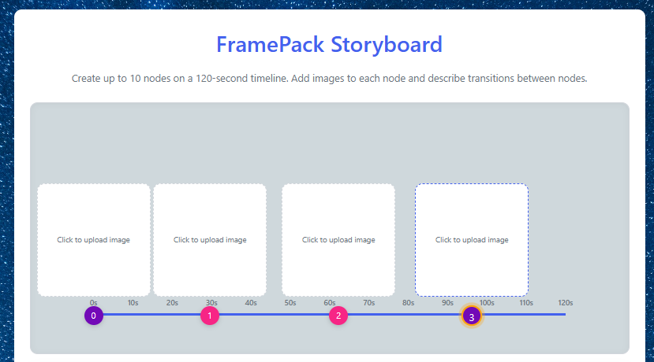
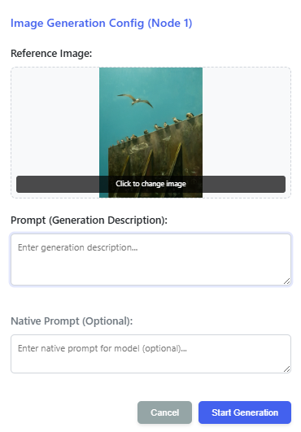
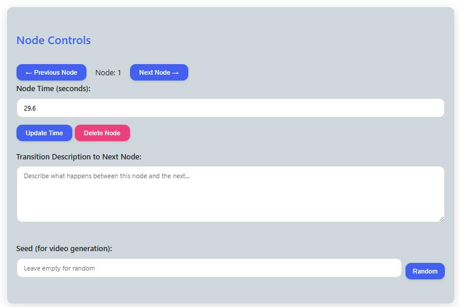
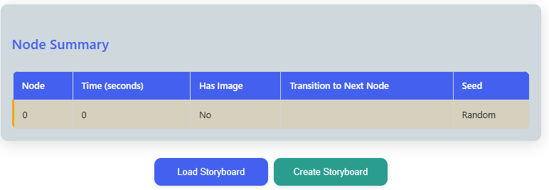

# Storyboard Project

A storyboard generation system based-on FramePack for up to 120-second video generation with **10 user-specified intermediate frames**, paired with an integrated image-editing AI agent.

## Installation

### Requirements
- Python 3.10+
- CUDA-compatible GPU (recommended)
- At least 24GB GPU memory

### Installation Steps

```bash
# Create virtual environment
conda create -n storyboard python=3.10 -y
conda activate storyboard

# Install PyTorch (CUDA version)
python -m pip install torch torchvision torchaudio --index-url https://download.pytorch.org/whl/cu126

# Install dependencies
pip install -r requirements.txt
```

## Usage

1. **Start the server**:
   ```bash
   python storyboard_server.py
   ```

2. **Access the web interface**:
   - Open your browser and visit `http://localhost:7860`

3. **Create storyboards**:
   
   ### Upload images to nodes

   

   You can upload or modify the uploaded image.

   

   ### Set transition descriptions

   In **Node Controls**, set each node’s time if needed and describe what happens between this node and the next in **Transition Description to Next Node**.

   

   ### Generate video sequences

   You can **load an existing storyboard** or **create a new storyboard** in **Node Summary** to start generating video.

   

   (Your storyboard will be stored in the `storyboard_outputs` folder.)

## Model downloads & disk space

**Automatic downloads:** The first time you use a feature, the corresponding weights are downloaded automatically (Hugging Face Hub, SAM checkpoint URLs, DIS-SAM IS-Net, etc.). No separate manual download step is required for normal use.

**Where files go (typical layout):**

| Location | What tends to land there |
|----------|---------------------------|
| `hf_download/hub/` (under the directory from which you start the server) | Qwen2.5-VL-7B-Instruct, SDXL outpaint stack (ControlNet Union + RealVisXL + VAE), and other code paths that set `cache_dir` to this folder |
| `~/.cache/huggingface/hub/` | FramePack / Hunyuan / SigLIP stack (`from_pretrained` without a project `cache_dir`), Qwen-Image-Edit-2509 + DFloat11 companion, ObjectClear, etc. |
| `checkpoints/` (inside this repo) | Segment Anything (`vit_h`) and DIS-SAM IS-Net weights |

**How much disk to plan for:**

- **Video generation only** (FramePack continuous path + SAM / segmentation as used): on the order of **45–55 GB** for the core video + local checkpoint folders.
- **All integrated features** (video + Qwen-VL + outpaint + Qwen-Image-Edit-2509 + ObjectClear + DIS-SAM/SAM), with **each weight stored once** (single cache layout): about **150–165 GB** is a realistic total.
- **Why people sometimes see ~200 GB+:** duplicate downloads (e.g. same repo under both `hf_download/` and `~/.cache/huggingface/`), optional extra checkpoints (e.g. alternate FramePack variants), or incomplete cleanups—not a requirement for the app to run.

*Note:* Point `HF_HOME` / `cache_dir` consistently if you want to avoid paying for the same model twice on disk.

**Context:** Local pipelines that combine *one* large video model plus VL + SDXL + heavy image editors are routinely in the **~100–200+ GB** range on disk—similar in order of magnitude to installing several popular ComfyUI / Automatic1111 model packs side by side. Users who only need storyboard **video** can stay near the **~50 GB** tier above; the big footprint is optional and comes from the bundled editing / reasoning stack.

## Model Licenses

This project integrates multiple third-party models, each distributed under its respective license terms.  
Users are responsible for complying with the original licenses when using or redistributing these components.

| Model Name | License Type | Commercial Use | Source Repository / Reference |
|-------------|---------------|----------------|--------------------------------|
| Qwen2.5-VL-7B-Instruct | Apache License 2.0 *(verify specific version; some releases may include additional restrictions)* | Permitted | [https://github.com/QwenLM/Qwen2.5-VL](https://github.com/QwenLM/Qwen2.5-VL) |
| DIS-SAM | MIT | Permitted | [https://github.com/Tennine2077/DIS-SAM/?tab=readme-ov-file](https://github.com/Tennine2077/DIS-SAM/?tab=readme-ov-file) |
| Segment Anything Model (SAM) | Apache License 2.0 | Permitted | [https://github.com/facebookresearch/segment-anything](https://github.com/facebookresearch/segment-anything) |
| FramePack | Apache License 2.0 | Permitted | [https://github.com/lllyasviel/FramePack](https://github.com/lllyasviel/FramePack) |
| ObjectClear | NTU S-Lab License 1.0 *(Non-Commercial)* | Not permitted | [https://github.com/zjx0101/ObjectClear](https://github.com/zjx0101/ObjectClear) |
| Qwen-Image-Edit | Apache License 2.0 | Permitted | [https://huggingface.co/Qwen/Qwen-Image-Edit](https://huggingface.co/Qwen/Qwen-Image-Edit) |
| Qwen-Image-Edit2509 | Apache License 2.0 | Permitted | [https://huggingface.co/Qwen/Qwen-Image-Edit-2509](https://huggingface.co/Qwen/Qwen-Image-Edit-2509) |


## License

This project is licensed under the MIT License. See the [LICENSE](LICENSE) file for details.
